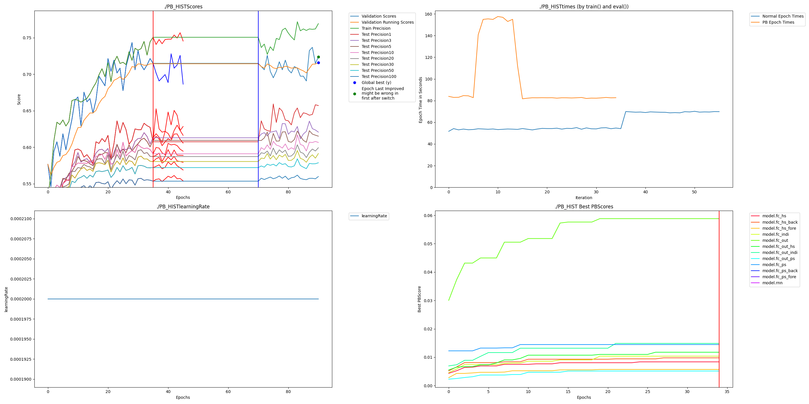

# PAI README
Checked out HIST source code February 5, 2024 from https://github.com/Wentao-Xu/HIST.  Additional information can be found in the README there.

To run with PAI:

    python -m pip install -r requirements.txt
    cd qlib
    python -m pip install -e .[dev] --config-settings editable_mode=strict
    cd -
    Extract the data from online into this folder
    # https://drive.google.com/drive/folders/1lGxaGxyw9GJCJHq5z_I34QwrhlZnWSSK?usp=sharing
    cp -r dotqlib/ /home/pai_user/.qlib
    pip install your perforated ai package

Run original code with:

    CUDA_VISIBLE_DEVICES=0 python learn.py --model_name HIST --data_set csi300 --hidden_size 128 --num_layers 2 --outdir ./output/csi300_HIST

Results:

    Test Precision:  {1: 0.6284454244762955, 3: 0.6163175303197354, 5: 0.6057331863285557, 10: 0.5945975744211687, 20: 0.588864388092613, 30: 0.5793458287394341, 50: 0.5688643880926131, 100: 0.5539470782800441}

    
Run PAI code with the following

    CUDA_VISIBLE_DEVICES=0 python learnPAI.py --model_name HIST --data_set csi300 --hidden_size 128 --outdir ./output/csi300_HIST
    
Results:
    
    Test Precision:  {1: 0.6549062844542448, 3: 0.6291804483645718, 5: 0.6202866593164278, 10: 0.607276736493936, 20: 0.5972987872105844, 30: 0.5898934215362, 50: 0.5777508269018743, 100: 0.5597133406835721}

# Changes of Note

## train.py vs trainPAI.py

    gf.checkedSkippedLayers = True
    
This is a required parameter when there are layers in the network that do not get used.  We don't know why these are needed, but we've seen this in multiple repositories so we just added it as a flag.  Without this setting when switching to Perforated Backpropagationtm learning mode an exception will be caught that required values aren't filled in and can't be used.  Setting this in the main script will just ignore when that happens instead of warning you.

    removing:
    #avg_params = average_params(params_list)
    #model.load_state_dict(avg_params)
    
Loading must be done with the loadSystem function or load_state_dict will cause problems.  Additionally, averaging the params causes the computation graph to be retained in between iterations.  There are many examples where things is fine for original networks, but when working with PAI memory leaks are caused.

