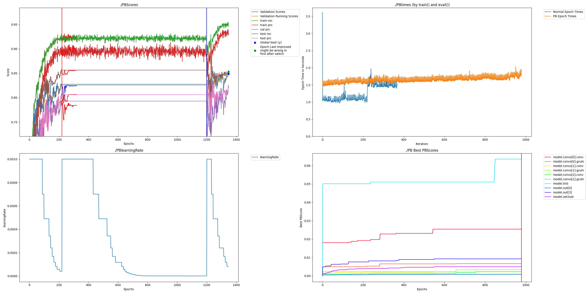

# PAI README
Checked out TrimNet source code January 10, 2024 from https://github.com/yvquanli/TrimNet.  A note about this repo:

The initial random seed has a significant impact on results.  You can see in our paper how wide the boxplot is compared to the other algorithms we improved. To that end, if you would like to replicate our results do the following:

- The data gets processed with ranomization, but then does not reprocess if the processed folder exists.  Therefore you must remove that folder on every run.
- For some reason the initial authors have a default seed of 68.  For our experiments we chose to start at 68 and increment up by 1 for each new seed.

It also seems, even with seeding, the results are not fully deterministic.  But we are confident with this method you will be able to replicate very close to our results if you try multiple seeds as well.
 
First run:

pip install -r requirements.txt
pip install your perforated ai package

Run original code with:

    CUDA_VISIBLE_DEVICES=0 python  trimnet_drug/source/run.py --gpu 0

Results:

    Epoch:199 bace test_loss:0.796 test_roc:0.740 test_prc:0.649 lr_cur:0.00000 time elapsed 0.02 hrs (1.1 mins)

Run PAI code with the following (dont include the rm for the first experiment): 

    rm trimnet_drug/data/processed/ -rf && CUDA_VISIBLE_DEVICES=0 python  trimnet_drug/source/runPAI.py --gpu 0 --seed 68

Results:
    
    Epoch:1568 bace test_loss:0.741 test_roc:0.846 test_prc:0.804 lr_cur:0.00000 time elapsed 0.67 hrs (40.5 mins)

    

# Changes of Note

## model.py vs modelPAI.py

    GRUCellLayerNorm

This replicates the same as the standard PBSequential for linear layers but allows two outputs for use with a GRU

