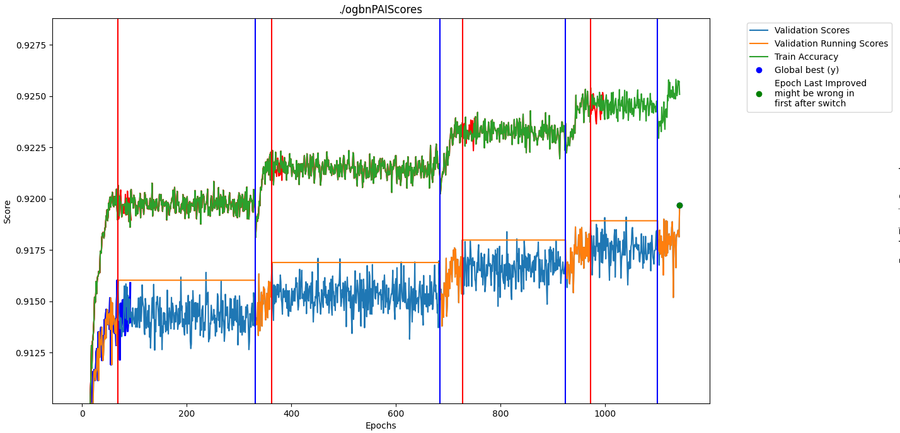

# PAI README

This example goes through adding Perforated Backpropagation to the pytorch geometric [ogbn-products example](https://github.com/pyg-team/pytorch_geometric/blob/b89c37ae9e0cac1d358c453df6954e45ca36fb43/examples/ogbn_train.py)

First checkout latest torch geometric code and docker

    git clone https://github.com/pyg-team/pytorch_geometric.git
    docker pull nvcr.io/nvidia/pyg:24.11-py3
    docker run --gpus all -i --shm-size=8g -v .:/pai -w /pai -t nvcr.io/nvidia/pyg:24.11-py3 /bin/bash

Within Docker

    cd pytorch_geometric
    pip install -e .
    cd ..
    pip install perforatedai
    
Run original with:

    CUDA_VISIBLE_DEVICES=0 python ogbn_train.py --dataset ogbn-products --batch_size 128 --model (sage or sgformer)

Results:

    Test Accuracy: 77.06%

Run PAI with:

    CUDA_VISIBLE_DEVICES=0 python ogbn_train_perforatedai.py --dataset ogbn-products --batch_size 128 --saveName ogbnPAI --model (sage or sgformer)
    
Results:

    Test Accuracy: 78.05%

Generated Graph should look similar to the following for sage:
    

